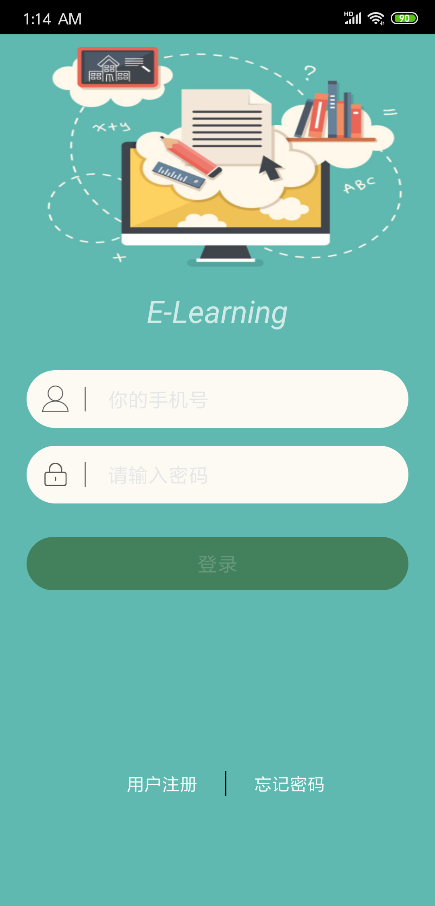
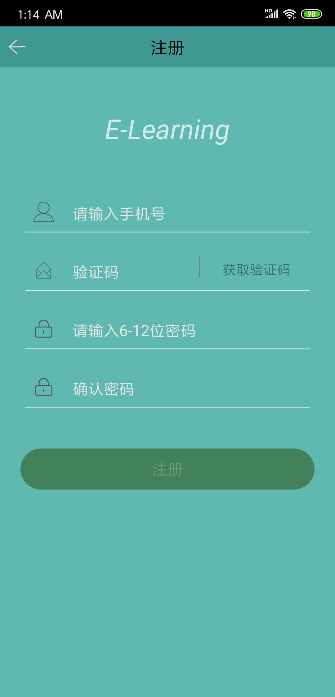
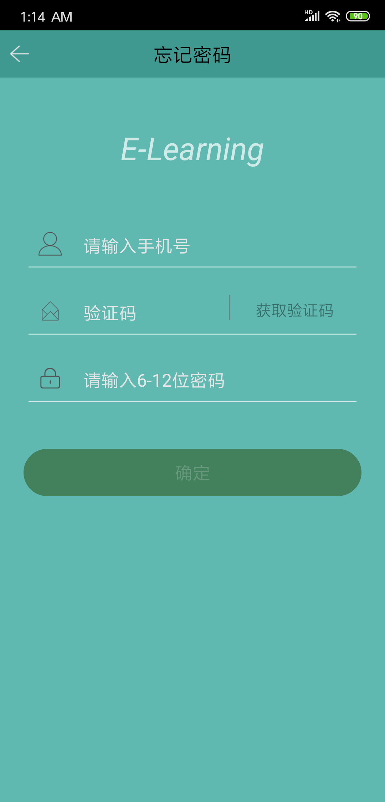
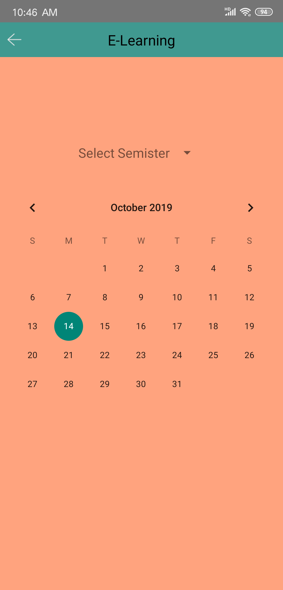
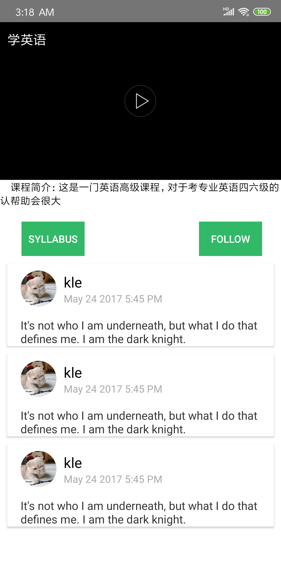
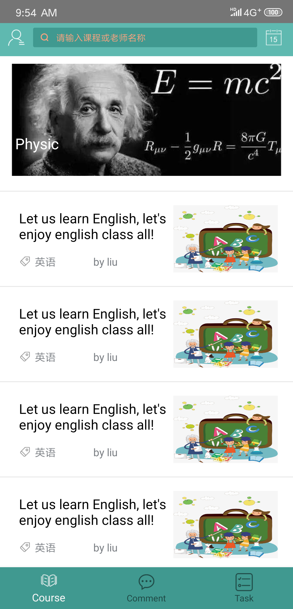
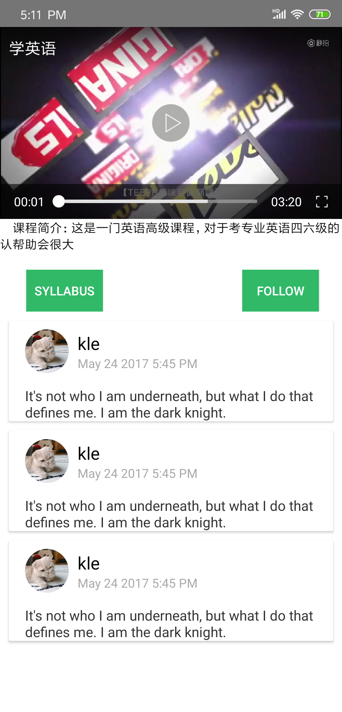
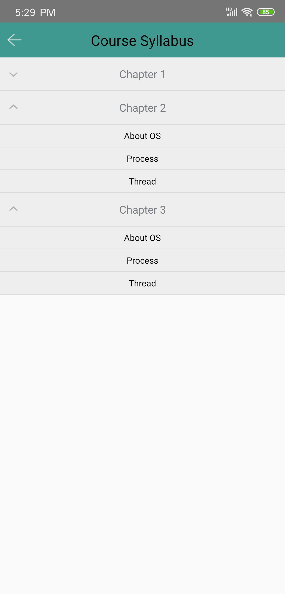
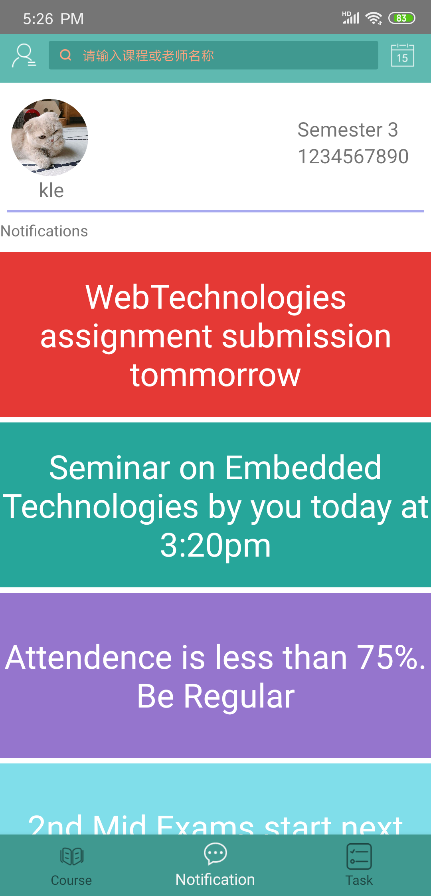
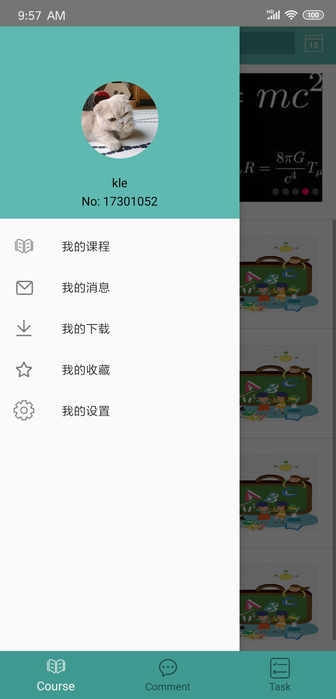

# ELearning
一个学习的App，注册、登录、课程浏览、课程学习、重要事项通知、自动更新等功能

# ScreenShots
### Login ###

welcome

register

find pwd

calendar

courseDeatil

courseList

video play

syllabus

notifications

drawerlayout

